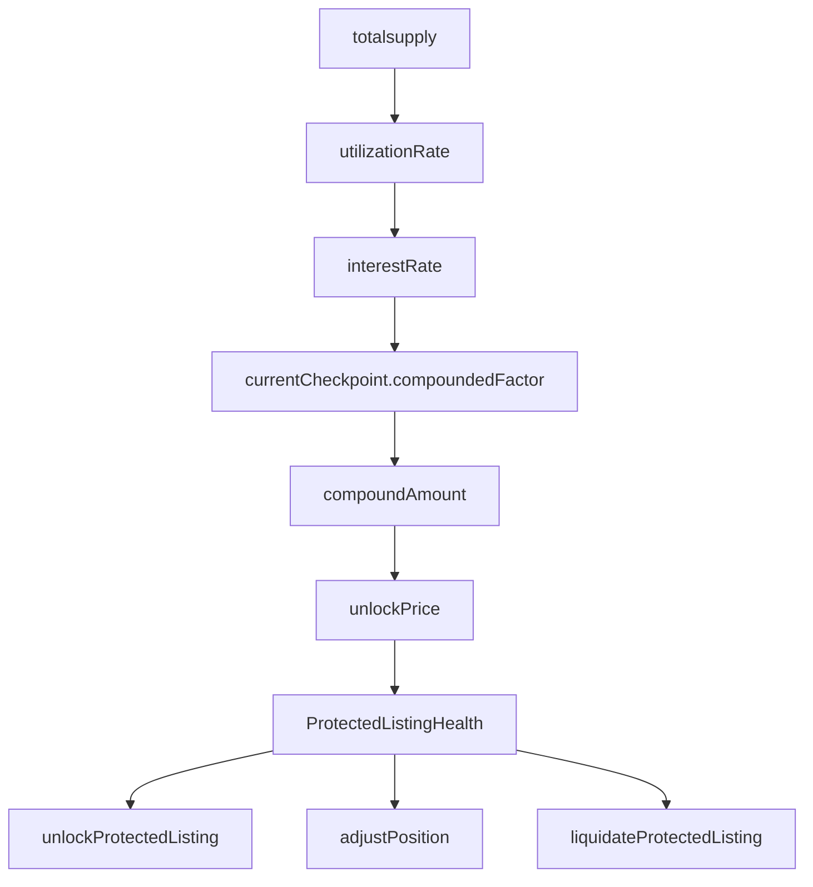

Rich Chrome Whale

High

# Malicious Whale can manipulate `totalsupply` to liquidate or illiquidate a liqudiateable listing

### Summary

Inorder to liquidate a listing we check the `ProtectedListingHealth`,  
Manipulating `totalsupply` affect `ProtectedListingHealth` through multiple steps (explained bellow), making a whale liquidate illiquidateable listing and vice versa.

- Malicious whale can `deposit` and `redeem` affecting `ProtectedListingHealth` as it depends on `totalsupply` of the collection making:
    - `unlockPrice_` more than `0.95 ether` And making a list liquidatable and benefit from the `KEEPER_REWARD`.
- Or vice versa sandwiching `ProtectedListings::liquidateProtectedListing` calling `redeem` and `deposit` and hold liquidatable position.

### Root Cause

Utilizationrate is whale manipulatable.

Its feasible to the whale since `redeem` and `deposit` can be called in the same txn and no economical harm is applied to him during the attack

### Internal pre-conditions

_No response_

### External pre-conditions

Whale having high number of NFTs

### Attack Path

In `ProtecterdListings::liquidateProtectedListing` to liquidate a listing it first check the collateral  
[ProtectedListings.sol#L429-L433](https://github.com/sherlock-audit/2024-08-flayer/blob/0ec252cf9ef0f3470191dcf8318f6835f5ef688c/flayer/src/contracts/ProtectedListings.sol#L429-L433)

```solidity
File: ProtectedListings.sol
428:     function liquidateProtectedListing(address _collection, uint _tokenId) public lockerNotPaused listingExists(_collection, _tokenId) {
429:         // Ensure that the protected listing has run out of collateral
430:@>       int collateral = getProtectedListingHealth(_collection, _tokenId); //@audit bug, iam thinking about flashLoans attacks to make his health factor negative
431:@>       if (collateral >= 0) revert ListingStillHasCollateral(); 
```

`collateral` is (0.95 ether - `unlcokPrice`).  
[ProtectedListings.sol#L497-L501](https://github.com/sherlock-audit/2024-08-flayer/blob/0ec252cf9ef0f3470191dcf8318f6835f5ef688c/flayer/src/contracts/ProtectedListings.sol#L497-L501)

```solidity
File: ProtectedListings.sol
496:     function getProtectedListingHealth(address _collection, uint _tokenId) public view listingExists(_collection, _tokenId) returns (int) {
497:         // So we start at a whole token, minus: the keeper fee, the amount of tokens borrowed
498:         // and the amount of collateral based on the protected tax.
499:@>       return int(MAX_PROTECTED_TOKEN_AMOUNT) - int(unlockPrice(_collection, _tokenId));
500:     }
```

`unlcokPrice` calculated by `listing.checkpoint` and `currentCheckpoint`.  
[ProtectedListings.sol#L607-L617](https://github.com/sherlock-audit/2024-08-flayer/blob/0ec252cf9ef0f3470191dcf8318f6835f5ef688c/flayer/src/contracts/ProtectedListings.sol#L607-L617)

```solidity
File: ProtectedListings.sol
606:     function unlockPrice(address _collection, uint _tokenId) public view returns (uint unlockPrice_) {
////code
610:         // Calculate the final amount using the compounded factors and principle amount
611:@>       unlockPrice_ = locker.taxCalculator().compound({
612:             _principle: listing.tokenTaken,
613:             _initialCheckpoint: collectionCheckpoints[_collection][listing.checkpoint],
614:@>           _currentCheckpoint: _currentCheckpoint(_collection) 
615:         });
616:     }
```

Going to `TaxCalcutaor::compound`the `_currentCheckpoint.compoundedFactor` affected by the `compoundAmount_`.  
[TaxCalculator.sol#L106-L119](https://github.com/sherlock-audit/2024-08-flayer/blob/0ec252cf9ef0f3470191dcf8318f6835f5ef688c/flayer/src/contracts/TaxCalculator.sol#L106-L119)

```solidity
File: TaxCalculator.sol
106:     function compound(
//code
117:@>       uint compoundedFactor = _currentCheckpoint.compoundedFactor * 1e18 / _initialCheckpoint.compoundedFactor;
118:@>       compoundAmount_ = _principle * compoundedFactor / 1e18;
119:     }
```

Going back to `ProtectedListings::unlockPrice`the `_currentCheckpoint.compoundedFactor` is calculated in `ProtectedListings::_currentCheckpoint` and affected by `_utilizationRate`  
[ProtectedListings.sol#L580-L593](https://github.com/sherlock-audit/2024-08-flayer/blob/0ec252cf9ef0f3470191dcf8318f6835f5ef688c/flayer/src/contracts/ProtectedListings.sol#L580-L593)

```solidity
File: ProtectedListings.sol
579:     function _currentCheckpoint(address _collection) internal view returns (Checkpoint memory checkpoint_) {
580:         // Calculate the current interest rate based on utilization
581:@>       (, uint _utilizationRate) = utilizationRate(_collection);
////code
586:         // Save the new checkpoint
587:         checkpoint_ = Checkpoint({
588:@>           compoundedFactor: locker.taxCalculator().calculateCompoundedFactor({
589:                 _previousCompoundedFactor: previousCheckpoint.compoundedFactor,
590:                 _utilizationRate: _utilizationRate,
591:                 _timePeriod: block.timestamp - previousCheckpoint.timestamp
592:             }),
```

First going to `ProtectedListings::utilizationRate`:  
**The `totalsupply` affects `utilizatoinRate`**.  
[ProtectedListings.sol#L261-L274](https://github.com/sherlock-audit/2024-08-flayer/blob/0ec252cf9ef0f3470191dcf8318f6835f5ef688c/flayer/src/contracts/ProtectedListings.sol#L261-L274)

```solidity
File: ProtectedListings.sol
260:     function utilizationRate(address _collection) public view virtual returns (uint listingsOfType_, uint utilizationRate_) {
////code
269:             // If we have no totalSupply, then we have a zero percent utilization
270:             uint totalSupply = collectionToken.totalSupply();
271:             if (totalSupply != 0) {
272:@>               utilizationRate_ = (listingsOfType_ * 1e36 * 10 ** collectionToken.denomination()) / totalSupply;
273:             }
```

Back to `ProtectedListings::_currentCheckpoint` we get `compoundedFactor` from `taxCalculator::calculateCompoundedFactor`  
[TaxCalculator.sol#L80-L91](https://github.com/sherlock-audit/2024-08-flayer/blob/0ec252cf9ef0f3470191dcf8318f6835f5ef688c/flayer/src/contracts/TaxCalculator.sol#L80-L91)

```solidity
File: TaxCalculator.sol
80:     function calculateCompoundedFactor(uint _previousCompoundedFactor, uint _utilizationRate, uint _timePeriod) public view returns (uint compoundedFactor_) {
81:         // Get our interest rate from our utilization rate
82:@>       uint interestRate = this.calculateProtectedInterest(_utilizationRate);
83: 
84:         // Ensure we calculate the compounded factor with correct precision. `interestRate` is
85:         // in basis points per annum with 1e2 precision and we convert the annual rate to per
86:         // second rate.
87:         uint perSecondRate = (interestRate * 1e18) / (365 * 24 * 60 * 60);
88: 
89:         // Calculate new compounded factor
90:@>         compoundedFactor_ = _previousCompoundedFactor * (1e18 + (perSecondRate / 1000 * _timePeriod)) / 1e18;
91:     }
```

`interestRate` is affected by `_utilizationRate`  
[TaxCalculator.sol#L59-L70](https://github.com/sherlock-audit/2024-08-flayer/blob/0ec252cf9ef0f3470191dcf8318f6835f5ef688c/flayer/src/contracts/TaxCalculator.sol#L59-L70)

```solidity
File: TaxCalculator.sol
59:     function calculateProtectedInterest(uint _utilizationRate) public pure returns (uint interestRate_) {
60:         // If we haven't reached our kink, then we can just return the base fee
61:         if (_utilizationRate <= UTILIZATION_KINK) {
62:             // Calculate percentage increase for input range 0 to 0.8 ether (2% to 8%)
63:@>           interestRate_ = 200 + (_utilizationRate * 600) / UTILIZATION_KINK;
64:         }
65:         // If we have passed our kink value, then we need to calculate our additional fee
66:         else {
67:             // Convert value in the range 0.8 to 1 to the respective percentage between 8% and
68:             // 100% and make it accurate to 2 decimal places.
69:@>           interestRate_ = (((_utilizationRate - UTILIZATION_KINK) * (100 - 8)) / (1 ether - UTILIZATION_KINK) + 8) * 100;
70:         }
```

Looking at those series of affections with a simple flow chart:



As said `ProtectedListingHealth` is affected by `totalsupply` through all the steps above, A whale could manipulate `totalsupply` affecting the `ProtectedListingHealth` and :

- liquidate a liquid position by front running `ProtectedListings::liquidateProtectedListing` with instant `deposit` and `redeem` manipulation `totalsupply` affecting `collateral` needed in `ProtectedListings::liquidateProtectedListing` .
- liquidate an liquid position by instant `redeem` and `deposit` and benefit from the `KEEPER_REWARD`.

### Impact

liquidation is whale manipulable.

### PoC

- First getting the consts 
	- The initial compoundfactor in `Taxcalculator::compound` this value is calculated throw creating a new listing and depends on `utilizationrate` assuming initial values is
		- `listingsOfType_` = 20
		- `totalsupply` = 100e18 and `utilizationRate` = 200000000000000000
		- then the `_initialCheckpoint.compoundedFactor` = 1e18

- The `_currentCheckpoint.compoundedFactor` depends on `utilizationRate` and `previousCheckpoint.compoundedFactor` and `_timePeriod` its the value of thime passed since the last compound factor
	- These values should be as follow
		-  assume `_timePeriod` = 10000
		- `listingsOfType_` = 20
		- `totalsupply` = 100e18 and `utilizationRate` = 200000000000000000
		- `previousCheckpoint.compoundedFactor` = 1e18 from previous
	- As result from the values above `_currentCheckpoint.compoundedFactor` = 1000110984271940000

- Computing `compoundAmount` from `_initialCheckpoint.compoundedFactor` and `_currentCheckpoint.compoundedFactor` assuming user take `_principle: listing.tokenTaken` = 5e17
	- `unlockPrice_` = `compoundAmount` = 2e17
- The health `ProtectedListingHealth` then will equal to 449445078640300000


- Manipulating the total supply and recalculate the `_currentCheckpoint.compoundedFactor` with the new `utilizationrate` with the same data with previous example
	- Will decrease the `totalsupply` to 1e18
	- `_currentCheckpoint.compoundedFactor` = 1280314561136470000
	- `unlockPrice_` = `compoundAmount` = 1280314561136470000
	- `ProtectedListingHealth` = -951572805682350000
- The value is negative that its liquidable whale can now liquidate the user and take the `KEEPER_REWARD = 0.05 ether` .
- This could be vice versa and whale hold A negative value indicates that a listing can be liquidated and if any user try to liquidate him he manipulate the `utilizationRate` and hold the position.

- The same method could be applied in `ProtectedListings::adjustPosition` making whale take more dept than he should, or prevent another user from taking a dept he suppose to take.
- This is applied too in `ProtectedListings::unlockProtectedLisitngs` manipulating `collateral` and pay less fees than he must, or make another user pay alot more fees than he supposed to pay.
### Mitigation

One of the solutions is to prevent `deposit` and `redeem` in same txn, since if a user wants another NFT he can do `swap` without manipulating the supply

Make it less feasible to the whale to carry the attack
